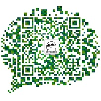

### 打卡记录

- [001-Two Sum（求两个数的和）](doc/001/readme.md) [代码](src/main/java/article/A001.java)
- [002-Add Two Numbers (单链表表示的两个数相加)）](doc/002/readme.md) [代码](src/main/java/article/A002.java)
- [003-Longest Substring Without Repeating Characters（最长非重复子字符串）](doc/003/readme.md) [代码](src/main/java/article/A003.java)

#### 联系我 -> 邮箱：06sscl@gmail.com   微信 -> 
